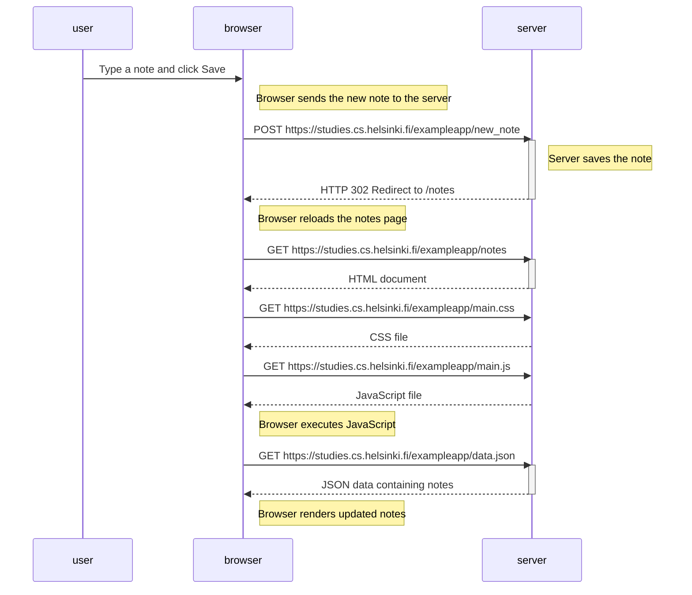

```mermaid
sequenceDiagram
    participant user
    participant browser
    participant server

    user->>browser: Type a note and click Save

    Note right of browser: Browser sends the new note to the server

    browser->>server: POST https://studies.cs.helsinki.fi/exampleapp/new_note
    activate server

    Note right of server: Server saves the note

    server-->>browser: HTTP 302 Redirect to /notes
    deactivate server

    Note right of browser: Browser reloads the notes page

    browser->>server: GET https://studies.cs.helsinki.fi/exampleapp/notes
    activate server
    server-->>browser: HTML document
    deactivate server

    browser->>server: GET https://studies.cs.helsinki.fi/exampleapp/main.css
    server-->>browser: CSS file

    browser->>server: GET https://studies.cs.helsinki.fi/exampleapp/main.js
    server-->>browser: JavaScript file

    Note right of browser: Browser executes JavaScript

    browser->>server: GET https://studies.cs.helsinki.fi/exampleapp/data.json
    activate server
    server-->>browser: JSON data containing notes
    deactivate server

    Note right of browser: Browser renders updated notes
```

  
